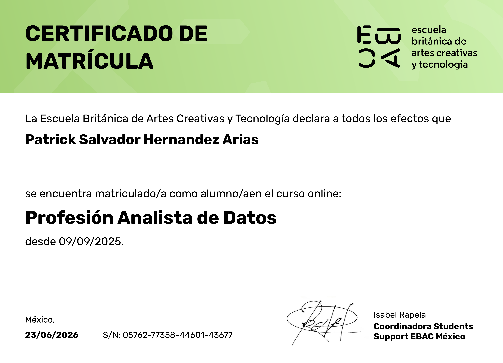

# Portafolio Académico y Profesional: EBAC

[cite_start]Bienvenido al repositorio central de mis certificaciones y trayectoria académica en la **Escuela Británica de Artes Creativas y Tecnología (EBAC)**[cite: 16, 29].

---

## 📊 1. Profesión: Analista de Datos
[cite_start]Certificación técnica que acredita competencias en procesamiento, análisis estadístico, modelado y visualización de datos[cite: 19].

* [cite_start]**Estado:** Graduado [cite: 18]
* [cite_start]**Fecha de emisión:** 05/05/2026 [cite: 14]
* [cite_start]**ID:** 50709-77358-98603-45293 [cite: 14]

---

## 🚀 2. Cómo potenciar tu talento
[cite_start]Formación en habilidades transversales y desarrollo de potencial profesional[cite: 9].

* [cite_start]**Estado:** Finalizado [cite: 9]
* [cite_start]**Fecha de emisión:** 13/05/2026 [cite: 2]
* [cite_start]**ID:** 06838-77358-16418-42551 [cite: 2]

---

## 🎓 3. Matrícula Académica
[cite_start]Certificación vigente de estudiante en el curso online de Profesión Analista de Datos[cite: 31, 32].

* [cite_start]**Fecha de vigencia:** 23/06/2026 [cite: 35]
* [cite_start]**ID:** 05762-77358-44601-43677 [cite: 36]

---
[cite_start]*Documentación consolidada por Patrick Salvador Hernández Arias[cite: 8, 17, 30].*
